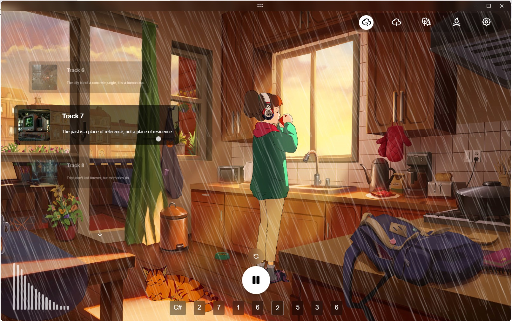
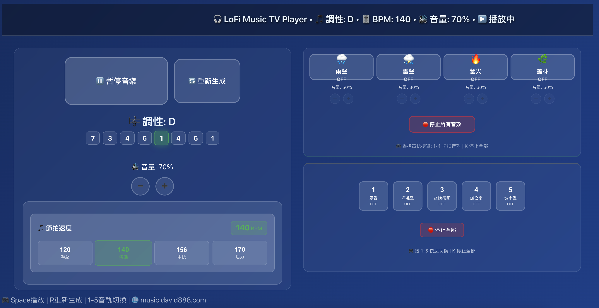
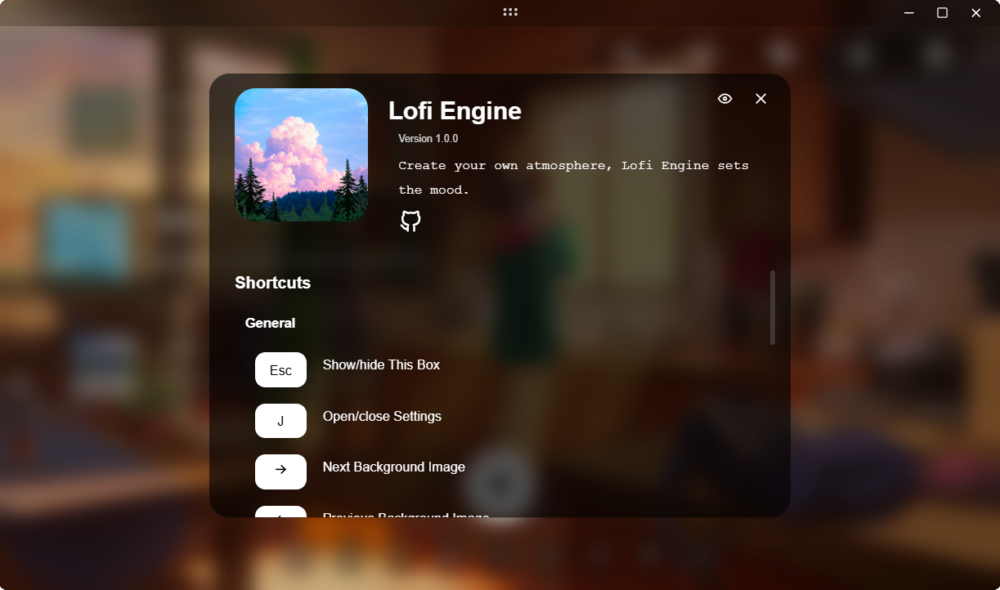

# LoFi Engine
<p align="center">
    
</p>

Generate LoFi music on the go. You create your own atmosphere; LoFi Engine sets the mood.

<p align="center">
   
</p>


## 🙏 致謝

本專案基於 [meel-hd/lofi-engine](https://github.com/meel-hd/lofi-engine) 開發，感謝原作者的貢獻！

---

## Table of Contents

- [Introduction](#lofi-engine)
- [Tech Stack](#tech-stack)
- [Features](#features)
- [New Features](#new-features)
- [Run Locally](#run-locally)
- [Roadmap](#roadmap)
- [Contributing](#contributing)
- [License](#license)

## Tech Stack

[](https://svelte.dev/)
[](https://www.typescriptlang.org/)
[](https://vitejs.dev/)
[](https://tauri.app/)
[](https://pnpm.io/)
[](https://tonejs.github.io/)

## Roadmap

- [x] Procedural LoFi track generation using Tone.js
- [x] Customizable ambient tracks
- [x] Customizable effects
- [x] Customizable look and feel
- [x] Keyboard shortcuts for all actions
- [x] Offline support
- [x] Cross-platform support (Linux, Mac, Windows)
- [x] [Browser deployment](https://lofi-engine.vercel.app/)
- [x] **Preset management** (save/load configurations)
- [x] **Recording functionality** (record your LoFi sessions)
- [x] **Timer system** (Pomodoro, sleep timer, custom timer)
- [x] **Instrument volume controls** (separate drum controls, **snare muted by default**)
- [x] **Intuitive track names** (Chinese labels instead of "Track 1", "Track 2")
- [x] **Random background on startup** (with manual random button)
- [x] **🎚️ Professional Audio Optimization** (triad voicing, voice separation, micro-timing)
- [ ] Purchasing a domain
- [ ] Mobile support (iOS, Android)
- [ ] More customization options and effects
- [ ] User feedback integration

---

## 🎵 Ambient Track List

The left sidebar displays 9 ambient tracks with intuitive Chinese names:

| ID | Track Name (中文) | Track Name (EN) | Audio Content |
|----|------------------|-----------------|---------------|
| 1 | 風聲 | Wind | Wind ambience |
| 2 | 海灘聲 | Beach Waves | Small waves onto the sand |
| 3 | 夜晚氛圍 | Night Ambience | Night environment sounds |
| 4 | 海鷗聲 | Seagulls | Urban seagulls |
| 5 | 辦公室 | Office | Office ambience |
| 6 | 城市聲 | City | City ambience |
| 7 | 伺服器 | Server | Old server sounds |
| 8 | 火車聲 | Train | Train to Munich |
| 9 | 水下白噪音 | Underwater | Underwater white noise |

**How to use**:
- Click any track card to play/pause
- Press number keys `1-9` to toggle tracks
- Use `↑` `↓` arrow keys to navigate
- Press `K` to stop all ambient tracks
- **Mobile**: Tap the bottom button "顯示音軌" to expand/collapse track list

---


## Features
* Create your own LoFi studio with your unique music with minimal touches from this and that. Be the Artist.
* Works with major desktop platforms: **Linux**, **Mac**, and **Windows**.
* Doesn't require an internet connection; your experience is fully private.
* LoFi Engine's main focus is **customization**, **accessibility**, and **artistic freedom**.

### Customization
1. **Playback**: If you want to listen to music or just listen to birds singing freely, you choose.
2. **Look**: With carefully crafted artworks from talented artists, long study sessions become a joy.
3. **Ambience**: A windy evening or the sound of waves crashing into the sand of a sunny beach brings peace.

### Accessibility
Any action or click you can do with the mouse has a shortcut for it with the keyboard. For playback, effects, ambient tracks, look, etc.

All information about the app and **shortcuts** is available in the *info box* accessible via the **ESC** key.



### Procedural LoFi Track Generation

The LoFi track is now generated procedurally using **Tone.js**, providing a dynamic and unique listening experience every time. We are actively seeking feedback from users to refine and improve the track generation process. Your input will help us enhance the quality, variety, and customization of the generated music.

If you have suggestions or encounter any issues, please let us know by opening an issue or contributing directly to the project. Together, we can make LoFi Engine even better!

#### 🎵 Music Generation Logic

LoFi Engine uses an **intelligent random generation system** rather than simple looped tracks:

##### 🎯 Core Generation System

**1. Chord Progression Generation**
- **Smart Harmonic Flow**: Based on music theory, each chord can only transition to specific next chords
- **Universal Key Support**: All 12 chromatic keys (C, C#, D, D#, E, F, F#, G, G#, A, A#, B) with consistent audio quality
- **8-Chord Progressions**: Generates sequences using proper voice leading rules
- **Cross-Platform Optimization**: Identical audio processing applies to both main interface and TV mode

**2. Chord Relationship Logic**
- **I (Tonic)**: Can go to ii, iii, IV, V, vi, vii (most flexible)
- **V (Dominant)**: Often resolves to I, iii, vi (classic resolution)
- **ii (Supertonic)**: Limited to iii, V, vii transitions
- Each chord has pre-defined possible successors based on harmonic theory

**3. Dynamic Layering System**
- **Piano**: Chord progression (every measure) + melody (every 8th note)
- **Drums**: Kick pattern + Snare (every 2 beats) + Hi-Hat (every quarter note)
- **Probabilistic Triggers**: Each instrument has random trigger chances (80-90%)

##### 🔄 Real-Time Variation System

**1. Instrument Randomization** (every 8 chords):
```
Kick Off: 15% chance to mute
Snare Off: 20% chance to mute  
Hi-Hat Off: 25% chance to mute
Melody Off: 25% chance to mute
```

**2. Melody Density Control**:
- **Adaptive Density**: 20%-50% random density per cycle
- **Weighted Intervals**: Uses mathematical weights for natural melodic movement
- **Scale Position Tracking**: Maintains musical context for smooth transitions

**3. Humanization Features**:
- **Timing Variations**: `humanize = true` adds natural micro-timing
- **Volume Fluctuations**: Subtle random velocity changes
- **Swing Feel**: Built-in swing quantization for groove

##### �️ **Audio Quality Optimization** (Latest Updates)

**1. Professional Chord Voicing**:
- **Triad Structure**: Reduced from 4-note to 3-note chords (Root + 3rd + 5th)
- **Voice Leading Separation**: Bass notes (C2-C3) isolated from harmony (C4+)
- **Frequency Clarity**: Eliminates muddy low-end by avoiding thirds in bass register

**2. Advanced Audio Processing Chain**:
```
High-Pass Filter (150Hz) → Compressor → Low-Pass Filter (1200Hz) → Reverb → Stereo Widener
```
- **HPF @ 150Hz**: Cleans up low-frequency buildup and rumble
- **Smart Compression**: -12dB threshold, 2:1 ratio for cohesive dynamics
- **Controlled Reverb**: Reduced to 0.5 to prevent excessive tail overlap
- **Stereo Width**: Optimized to 0.3 to avoid phase issues

**3. Micro-Timing & Dynamics**:
- **Velocity Randomization**: ±15% variation per note for natural feel
- **Onset Staggering**: 5-15ms random delays prevent machine-like attack
- **Note Separation**: 2ms intervals between chord tones for organic roll effect
- **Release Optimization**: Shortened envelope release (0.2s) to prevent note overlap

**4. Optimized Note Duration**:
- **Bass Notes**: Shortened to half-note (2n) duration for clarity
- **Harmony Notes**: Full measure (1n) for sustained chord progression
- **Frequency Isolation**: Complete separation between bass and treble registers

##### �🎛️ User Controls

- **Press `R`**: Generate completely new progression (new key + new chord sequence)
- **Press `M`**: Toggle melody on/off
- **Individual Volumes**: Control piano, kick, snare, hi-hat independently
- **BPM Control**: Adjust tempo (default: 156 BPM)

This system can generate **virtually infinite musical variations** while maintaining musical coherence and the characteristic LoFi aesthetic!

### ☕ Café 與 🎷 Jazz 曲風概覽

| 特性 | Café | Jazz |
| --- | --- | --- |
| 基礎 BPM | 84 | 112 |
| Swing | 0.45（輕微搖擺） | 0.58（較大搖擺） |
| Chord Voicing | 多為 3 聲部 triad，偶爾加入 7th | triad 與延伸音混合，偏向 7th/9th | 
| Strum 模式 | 緩慢掃弦、反向掃弦、單音 | 多音掃弦、快節奏切分、延長音 |
| Melody Density | 18% – 33%，以流動平穩為主 | 28% – 48%，帶有 improvisation 感 |
| Melody Direction | 偏向向上或平移，偶爾下行 | 在同 key 或鄰近 key 上做 step/leap 結合 |
| Progression Duration | 約 4.5–5.5 分鐘自動輪替 | 約 4–5 分鐘自動輪替 |

### 🧠 長篇章編曲機制（New）

為了避免「短迴圈感」，現在的生成邏輯會預先配置長達 5 分鐘的編曲片段，並在段落之間加入自然過渡：

1. **段落池（Progression Pool）**  
   - 每種曲風維持一個近似 5 分鐘的段落池，Cafe 預設 3 段、Jazz 預設 4 段。  
   - 透過 circle-of-fifths 與相鄰 key 偏好，讓下一段 harmonic movement 更自然。  

2. **自動輪替**  
   - 每段播放時間落在設定的 `durationRangeSeconds` 範圍（約 260–320 秒）。  
   - 播放次數或時間達標後，預載下一段並以小音量“預告”掃弦（preview strum）接上。 

3. **旋律方向偏好**  
   - 每段開始時設定一個方向偏好（上行／平行／少量下行）與 leap 機率。  
   - Melody 會依偏好調整 interval weight，避免長時間下行造成情緒低落。  

4. **鋼琴掃弦優化**  
   - 新增 `strumChord` helper 控制 velocity、jitter、反向掃弦。  
   - 在段落轉換前預掃新和弦，讓耳朵提前適應下一主題。  

> PC 與 TV 版本共用上述音樂機制，TV 介面新增 Café/Jazz 切換鍵、響應式尺寸與同樣的長篇章播放。 

---

## 📺 TV Version

LoFi Engine now includes a **dedicated TV mode** optimized for Android TV devices and large screen displays!

### 🚀 Access TV Mode

Simply add `/tv` to the end of your URL:

- **Production**: `music.david888.com/tv`
- **Development**: `localhost:5173/tv`

### 📱 TV-Optimized Features

#### 🎛️ Horizontal Layout Design

- **Left Panel**: Large music player with play/pause controls
- **Right Panel**: Simplified control interface optimized for TV remotes
- **TV-Friendly**: Designed specifically for landscape orientation and couch viewing

#### ⚡ Performance Optimized

- **Lightweight Interface**: Reduced visual complexity for better performance on Android TV devices
- **Identical Audio Quality**: Same professional audio processing chain as main version
- **All 12 Keys Supported**: Complete chromatic key support (C, C#, D, D#, E, F, F#, G, G#, A, A#, B)
- **Optimized Chord Voicing**: Professional triad structure with separated bass/harmony registers
- **Fast Loading**: Optimized for devices with limited processing power

#### 🎵 Music Controls (TV Version)

- **Simple Play/Pause**: Large, easy-to-see controls
- **Key Display**: Current key signature prominently shown
- **BPM Control**: Visible tempo adjustment
- **Progress Indicator**: Clear progression tracking

#### 🌊 Ambient Tracks (TV Simplified)

- **Visual Track List**: Clean grid layout of ambient tracks
- **One-Click Toggle**: Easy track activation/deactivation
- **Track Status**: Clear visual feedback for active tracks

### 💡 Why TV Version?

**Problem Solved**: Many users reported performance issues when using LoFi Engine on Android TV devices with limited processing power.

**Solution**: Dedicated TV interface that:

- ✅ Maintains the same **intelligent music generation** using Tone.js
- ✅ Preserves **chord progressions** (C, A#, music theory-based transitions)
- ✅ Keeps **dynamic layering system** (piano, drums, melody)
- ✅ Optimizes **UI performance** for TV devices
- ✅ Provides **horizontal layout** for TV screens

### 🎯 Technical Details

- **Automatic Route Detection**: App automatically loads TV version when `/tv` path is detected
- **Same Music Engine**: Identical Tone.js implementation as desktop version
- **Responsive Design**: Adapts to various TV screen sizes
- **Touch & Remote Friendly**: Large buttons and simple navigation

**Perfect for**: Relaxing on the couch, study sessions on the big screen, or ambient background music for your living room! 🛋️

---

## New Features 🎉

LoFi Engine now includes powerful new features to enhance your music experience!

### 📍 How to Access New Features

**Quick Access**: Press `ESC` key to open the Info Panel, then click on "✨ New Features" tab to see all features with direct controls!

**Alternative**: Click the Settings icon (⚙️) in the top-right corner or press `J` key.

---

### 🎵 Preset Management

Save and load your favorite configurations with ease:

- **Save current settings**: Store your perfect mix of volume, key, BPM, and background
- **Quick load**: Restore any saved preset with one click
- **Export/Import**: Share presets with friends or backup your configurations (JSON format)
- **Reset to default**: Restore factory settings if something goes wrong (red button at bottom)

**Storage**: All presets are stored in browser localStorage - no account needed!

---

### 🎙️ Recording Functionality

Capture your LoFi sessions:

- **Record your mix**: Save the complete audio including all effects and ambient sounds
- **Flexible duration**: Choose from 1, 5, 10, 30, or 60 minutes
- **Easy download**: Export as WebM audio file
- **High quality**: Records exactly what you hear

**Important**: Start playing music first, then begin recording.

---

### ⏰ Timer System

Three powerful timer modes to boost your productivity:

#### 🍅 Pomodoro Timer
- Classic focus technique: 25 min work + 5 min break
- Customizable work/break durations
- Auto-cycling with notifications

#### 😴 Sleep Timer
- Auto fade-out music after set duration
- Perfect for falling asleep
- Smooth 3-second fade effect

#### ⏱️ Custom Timer
- Set any duration (1-240 minutes)
- Simple countdown with alerts
- Ideal for focused work sessions

---

### 🎛️ Instrument Volume Controls

Fine-tune each instrument independently:

- **Piano volume**: Adjust keyboard melody level
- **Kick drum volume**: Control bass drum intensity (default: 70%)
- **Snare volume**: Modify snare drum presence (**default: 0% - muted**)
- **Hi-hat volume**: Set cymbal brightness (default: 50%)
- **Toggle instruments**: Completely mute individual drums with one click

**Quick Presets**:
- 🎹 **Pure Piano**: Remove all drums instantly
- 🥁 **Light Drums**: Balanced drum mix
- 🔄 **Reset**: Back to default volumes

**💡 Tip**: Don't like drum sounds? Use the "Pure Piano" preset or slide all drum volumes to 0%!

---

### 💾 Data Storage

All your presets, instrument volumes, and configurations are safely stored in your browser's localStorage. They persist across sessions without requiring an account or internet connection.

**Reset Everything**: If you mess up your settings, use the "Reset to Default" button in Preset Management to restore factory settings!

---

### 🎨 Random Background (New!)

Enjoy a fresh look every time you open the app:

#### Bing 每日高清桌布 (新功能!) 🌐

- **一鍵切換**: 點擊 "Bing 每日桌布" 按鈕使用 Bing API 提供的高清背景
- **智能設備偵測**: 自動識別設備類型
  - 📱 **手機版**: 使用 `bing.img.run/m.php` (手機優化)
  - 💻 **桌面版**: 使用 `bing.img.run/1920x1080.php` (高解析度)
- **自動每日更新**: 每天自動檢測並更新為最新的 Bing 每日桌布
- **智能快取**: 同一天內使用快取，避免重複載入
- **自動回退**: 若 API 載入失敗，自動切換到本地背景
- **即時更新**: 手動點擊按鈕可隨時更新到最新桌布

#### 本地背景隨機功能

- **Auto-random on first load**: When you first open the app, a random background is selected automatically
- **Manual random button**: Click the "🔄 隨機本地背景" button to randomly select from 10 built-in backgrounds
- **Smart selection**: Ensures the new random background is different from the current one

**How to access**: Press `J` key → Background section → Choose between Bing API or local backgrounds

**Benefits**:

- 🌍 Access thousands of high-quality Bing wallpapers
- 📱 Automatically adapts to your device (mobile/desktop)
- 📦 Fallback to 10 beautiful built-in backgrounds
- 🔒 Reliable and always works even without internet

---

### 🎵 Intuitive Track Names (New!)

Ambient tracks now display meaningful Chinese names instead of generic "Track 1", "Track 2":

- Easy to understand at a glance (e.g., "海灘聲" for beach waves)
- See the full track list in the [Ambient Track List](#-ambient-track-list) section
- Original quote descriptions are preserved

**Benefits**: No more guessing what each track contains!

---

## Run Locally

To run LofiEngine locally, follow these steps:

### Prerequisites

- [Node.js](https://nodejs.org/) (v14 or later)
- [pnpm](https://pnpm.io/) (v6 or later)
- [Rust](https://www.rust-lang.org/) (latest stable version)
- [Tauri prerequisites](https://tauri.app/v1/guides/getting-started/prerequisites) (based on your operating system)

### Installation

1. Clone the repository:
   ```bash
   git clone https://github.com/tbdavid2019/music-lofi
   cd music-lofi
   ```

2. Install dependencies:
   ```bash
   pnpm install
   ```

### Development

To run the app in development mode:

```bash
pnpm tauri:d
```

This command will start both the Vite dev server for the frontend and the Tauri development process for the native shell.

### Building

To build the app for production:

```bash
pnpm tauri:b
```

This will create a production-ready build of your application in the `src-tauri/target/release` directory.

### Additional Commands

- `pnpm dev`: Run the Vite development server without Tauri
- `pnpm build`: Build the frontend assets without Tauri
- `pnpm preview`: Preview the built frontend
- `pnpm check`: Run Svelte type checking

---

## 🚀 Deployment

LoFi Engine supports multiple deployment options for web access:

### Quick Deploy Options

#### Vercel (Recommended) ⚡
[](https://vercel.com/import/project?template=https://github.com/tbdavid2019/music-lofi)

1. Click the button above or visit [vercel.com](https://vercel.com)
2. Import this repository
3. Deploy with one click - zero configuration needed!

#### GitHub Pages 📄
Automatically deploys on push to `master` branch:
1. Enable GitHub Pages in repository settings
2. Select "GitHub Actions" as source
3. Push your code and visit: `https://[username].github.io/lofi-engine/`

#### Netlify 🎯
[](https://app.netlify.com/start/deploy?repository=https://github.com/tbdavid2019/music-lofi)

Click the button above and follow the prompts.

### Detailed Instructions

For comprehensive deployment guides including:
- Step-by-step instructions for each platform
- Custom domain setup
- Environment variables configuration
- Troubleshooting tips

**📖 See [DEPLOYMENT.md](./DEPLOYMENT.md) for complete deployment documentation.**

---

## Contributing
We welcome contributions from the community! If you're interested in contributing to LoFi Engine, please follow these steps:
1. Fork the repository.
2. Create a new branch for your feature or bugfix.
3. Make your changes and commit them with clear and descriptive messages.
4. Push your changes to your fork.
5. Open a Pull Request to the `main` branch of this repository.
